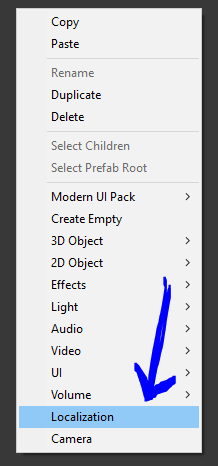
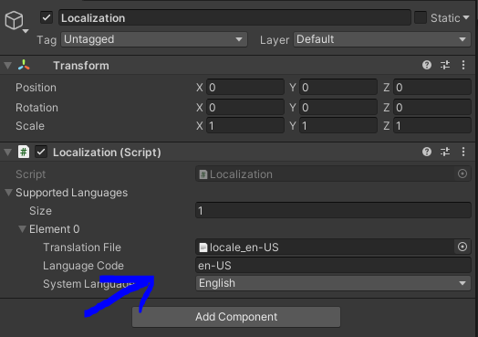

[](https://www.npmjs.com/package/com.3d-group.unity-simple-localization)
[](https://openupm.com/packages/com.3d-group.unity-simple-localization/)

[](https://opensource.org/licenses/MIT)

# Localization

Simple localization package for Unity game engine.

- [How to use](#how-to-use)
- [Install](#install)
  - [via npm](#via-npm)
  - [via OpenUPM](#via-openupm)
  - [via Git URL](#via-git-url)
  - [Tests](#tests)
- [Configuration](#configuration)

<!-- toc -->

## How to use

Create localization singleton



Add translations (json files as TextAssets)



Use from scripts with
```c#
var translation = Localization.Translate("TRANSLATION_KEY");
```

To add translations for existing Text / Text mesh pro UI components, add TranslateTextOnStart component

## Install

### via npm

Open `Packages/manifest.json` with your favorite text editor. Add a [scoped registry](https://docs.unity3d.com/Manual/upm-scoped.html) and following line to dependencies block:
```json
{
  "scopedRegistries": [
    {
      "name": "npmjs",
      "url": "https://registry.npmjs.org/",
      "scopes": [
        "com.3d-group"
      ]
    }
  ],
  "dependencies": {
    "com.3d-group.unity-simple-localization": "1.0.0"
  }
}
```
Package should now appear in package manager.

### via OpenUPM

The package is also available on the [openupm registry](https://openupm.com/packages/com.3d-group.unity-simple-localization). You can install it eg. via [openupm-cli](https://github.com/openupm/openupm-cli).

```
openupm add com.3d-group.unity-simple-localization
```

### via Git URL

Open `Packages/manifest.json` with your favorite text editor. Add following line to the dependencies block:
```json
{
  "dependencies": {
    "com.3d-group.unity-simple-localization": "https://github.com/3d-group/unity-simple-localization.git"
  }
}
```

### Tests

The package can optionally be set as *testable*.
In practice this means that tests in the package will be visible in the [Unity Test Runner](https://docs.unity3d.com/2017.4/Documentation/Manual/testing-editortestsrunner.html).

Open `Packages/manifest.json` with your favorite text editor. Add following line **after** the dependencies block:
```json
{
  "dependencies": {
  },
  "testables": [ "com.3d-group.unity-simple-localization" ]
}
```

## Configuration

Add translations in the inspector.
1. Add translation json files to your projects Assets folder
2. Drag resulting TextAsset files to Localization inspector field

Translation file format:
```json
{
  "TRANSLATION_KEY": "translation"
}
```


## License

MIT License

Copyright © 2020 3D Group
